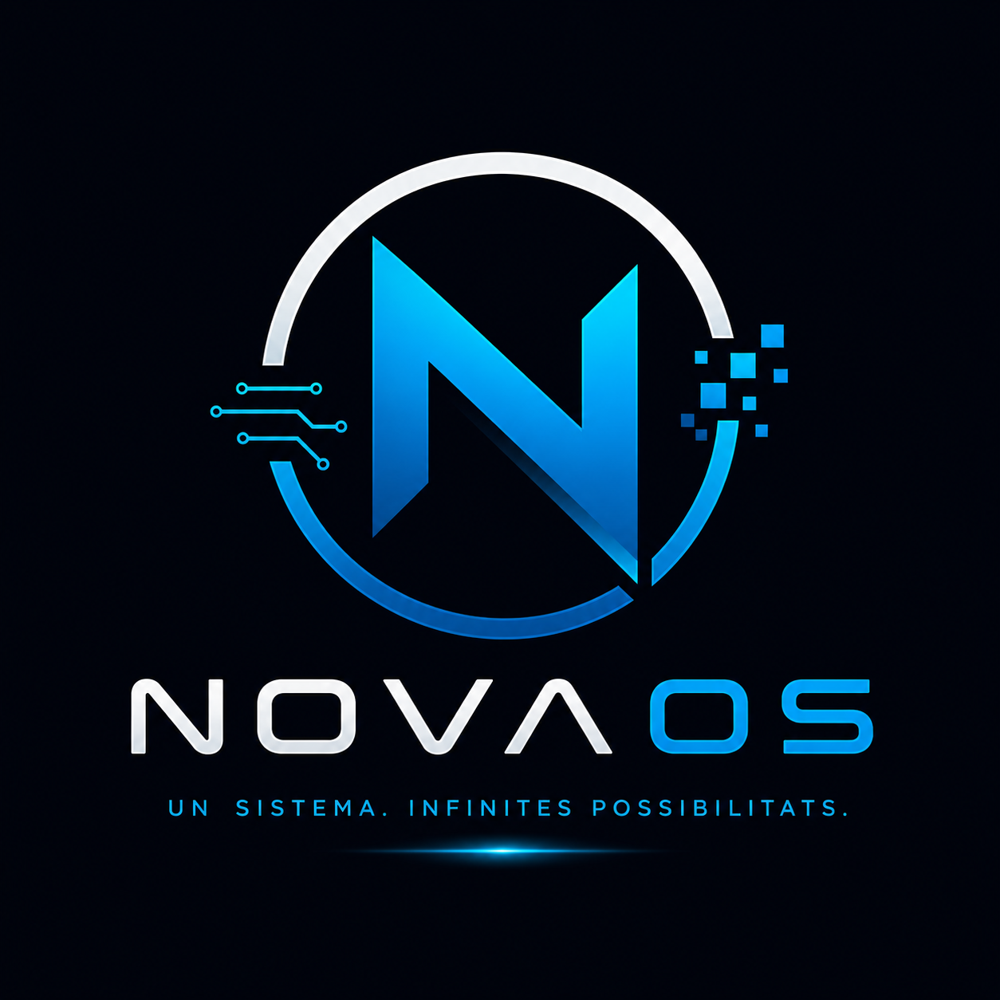

# NovaOS

NovaOS es un sistema operativo basado en Cosmos desarrollado como proyecto educativo para aprender sobre el desarrollo de sistemas operativos en C#.

Este proyecto servirá como base para desarrollar nuevas funcionalidades del sistema operativo.

## Miembros del grupo
- Daniel
- Nombre compañero
- Nombre compañero

## Logo
